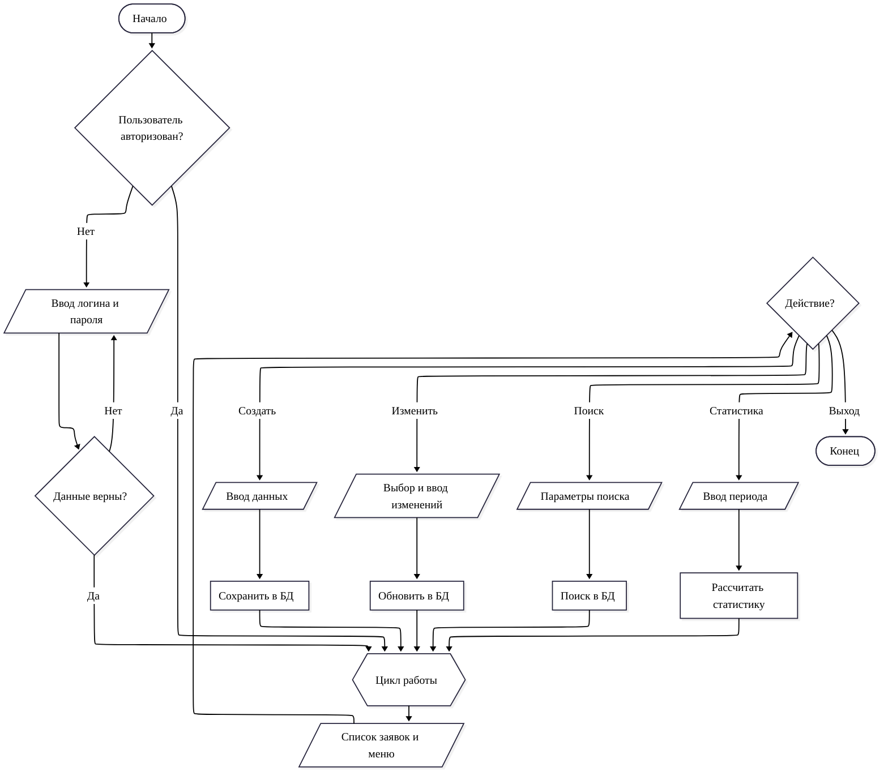
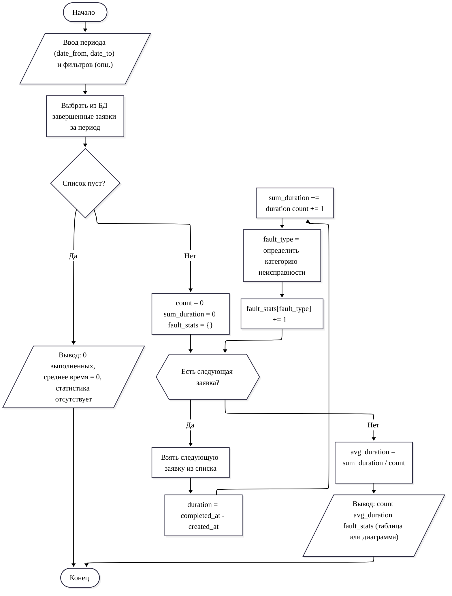

# Учебная практика — Задание 1 (анализ ТЗ, спецификация, алгоритмы)

## 1. Краткая спецификация модуля

**Наименование:** модуль учета заявок на ремонт климатического оборудования.

**Цель:** автоматизировать регистрацию, обработку, исполнение и контроль заявок, а также формирование статистики работы сервисной службы.

**Стек реализации (принят):**
- Back-end: Python + Flask
- Хранилище: SQLite
- Front-end: HTML (+ общий CSS‑стиль проекта)

### 1.1. Участники (роли)

В рамках требований ТЗ (Приложение 1) для обеспечения разграничения доступа фиксируются роли:

1) **Администратор**
- Создание/блокировка пользователей
- Назначение ролей

2) **Оператор (диспетчер)**
- Регистрация новой заявки
- Редактирование заявки (описание проблемы, этап/статус, назначение ответственного)
- Поиск и просмотр заявок

3) **Специалист**
- Просмотр назначенных заявок
- Изменение статуса/этапа в рамках исполнения
- Добавление комментариев по заявке
- Фиксация информации о заказанных комплектующих

> Примечание: роль «менеджер по качеству» и QR‑код для отзывов относятся к дополнению (Приложение 3) и планируются отдельной итерацией/заданием, чтобы не смешивать требования разных заданий.

### 1.2. Сущности (логическая модель уровня модуля)

**Заявка (Request/Ticket)** — центральная сущность, содержащая обязательные поля из ТЗ:
- `request_number` — номер заявки (уникальный)
- `created_at` — дата/время добавления
- `equipment_type` — тип оборудования
- `device_model` — модель устройства
- `problem_description` — описание проблемы
- `customer_full_name` — ФИО заказчика
- `customer_phone` — номер телефона
- `status` — статус/этап (минимум: «открыта», «в процессе ремонта», «завершена»; дополнительно: «ожидание комплектующих»)

Для выполнения требований ТЗ о назначении ответственного и расчете времени выполнения, в данных заявки также должны присутствовать (как минимум на уровне БД/модели):
- `assigned_specialist_id` — ответственный специалист (nullable до назначения)
- `completed_at` — дата/время завершения (nullable до завершения)

Дополнительные сущности для требований ТЗ:
- **Пользователь** (логин, пароль-хэш, роль)
- **Комментарий специалиста** (привязан к заявке и пользователю)
- **Заказанные комплектующие** (позиции, привязанные к заявке)
- **История статусов** (для фиксации смены статуса и отображения «уведомлений» в интерфейсе)

### 1.3. Входные данные (формы/экраны)

1) **Форма входа**
- `login`
- `password`

2) **Форма создания заявки (оператор)**
- Тип оборудования
- Модель устройства
- Описание проблемы
- ФИО заказчика
- Телефон

3) **Форма редактирования заявки (оператор)**
- Этап/статус
- Описание проблемы
- Ответственный специалист

4) **Форма работы специалиста по заявке**
- Смена статуса (в рамках процесса ремонта)
- Добавление комментария
- Добавление/редактирование заказанных комплектующих

5) **Форма поиска заявок**
- Номер заявки (точный поиск)
- Параметры (тип оборудования, модель, статус, ФИО, телефон, период дат)

6) **Форма статистики**
- Период (дата/время «с» и «по»)
- (опционально) фильтры по типу оборудования/статусу

### 1.4. Выходные данные (результаты)

- Список заявок (с фильтрами/поиском)
- Карточка заявки (все поля + комментарии + комплектующие + история статусов)
- Сообщения пользователю (ошибки/предупреждения/успех)
- Отчет статистики:
  - количество выполненных заявок
  - среднее время выполнения заявки
  - статистика по типам неисправностей (минимум: группировка по нормализованному описанию/категории)

### 1.5. Правила валидации и обработки ошибок (для соответствия ТЗ)

- Обязательные поля не могут быть пустыми.
- Номер телефона проверяется по формату (минимум: только цифры + допустимые символы `+`, пробел, `-`, скобки).
- Номер заявки уникален (генерация на стороне системы + проверка конфликта).
- Перед удалением заявки обязательно подтверждение (UI).
- При отсутствии результатов поиска выводится информативное сообщение.
- Для ошибок доступа: запрет операции + сообщение «Недостаточно прав».
- Все сообщения пользователю имеют тип: **информация / предупреждение / ошибка** и единый визуальный стиль.

## 2. Основной алгоритм учета заявок (блок‑схема)

Нотация блок‑схемы соответствует ГОСТ 19.701 по смыслу используемых блоков (начало/конец, ввод/вывод, процесс, решение). Формат — Mermaid для удобной вставки в отчет.

## 3. Детализация функции: расчет статистики (блок‑схема)

Функция покрывает требования ТЗ:
- количество выполненных заявок
- среднее время выполнения заявки
- статистика по типам неисправностей

Определения:
- выполненная заявка — заявка со статусом «завершена» и заполненным `completed_at`.
- время выполнения — `completed_at - created_at`.
- тип неисправности — категория, выделенная из `problem_description` (или отдельное поле категории, если будет введено в UI).

## 4. Перечень экранов (интерфейс) и навигация

Минимальный набор страниц для реализации алгоритма:
- `Вход` → `Список заявок`
- `Список заявок` ↔ `Карточка заявки`
- `Список заявок` ↔ `Создание заявки`
- `Список заявок` ↔ `Поиск`
- `Список заявок` ↔ `Статистика`

Требования к интерфейсу:
- единый заголовок страницы (название модуля + текущий раздел)
- единый стиль кнопок/форм
- кнопка «Назад» на формах создания/редактирования и в карточке заявки
- информативные сообщения об ошибках/предупреждениях/успехе
