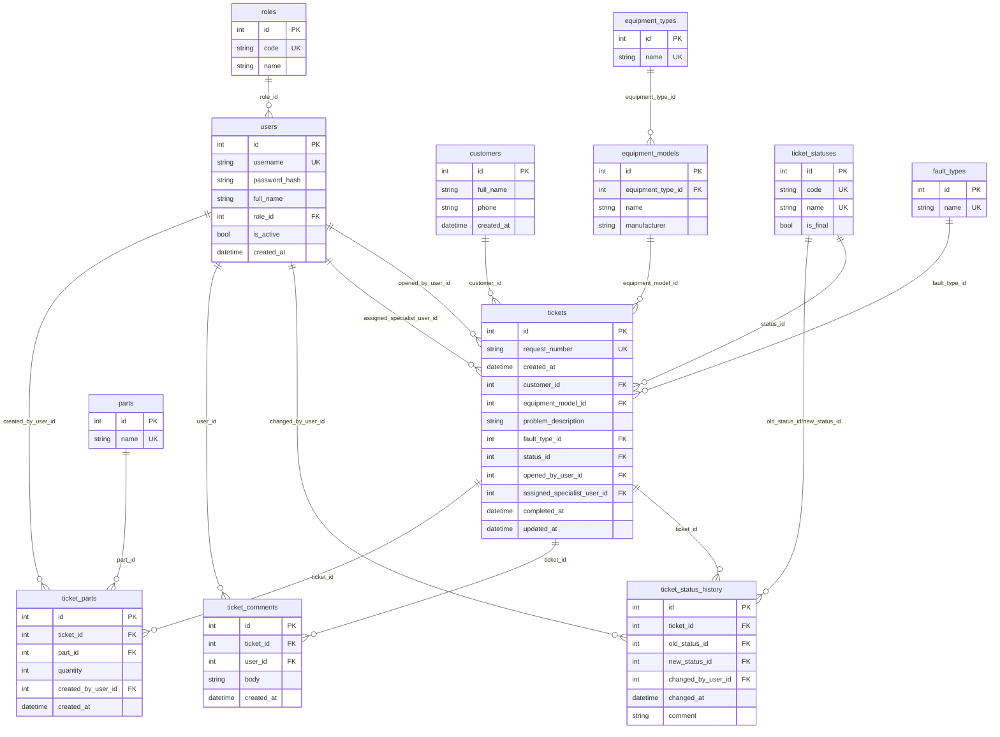

# Учебная практика — Задание 2 (ERD, 3НФ, БД, импорт, отчеты, backup)

## 1. Назначение и требования

Необходимо спроектировать ER‑диаграмму для учета заявок на ремонт климатического оборудования с соблюдением:
- **3 нормальной формы (3НФ)**;
- **ссылочной целостности** (PK/FK + ограничения на удаление/изменение);
- единого стиля именования таблиц/полей.

Также требуется:
- создать БД и таблицы;
- заполнить БД данными из файлов `import`;
- подготовить SQL‑запросы/отчеты;
- выполнить резервное копирование БД;
- определить принцип регистрации пользователей, создать группы (роли) и уровни доступа.

## 2. Принятые соглашения

- Имена таблиц и полей: `snake_case`.
- Таблицы: во множественном числе (`users`, `tickets`, `customers`).
- Первичный ключ: `id`.
- Внешние ключи: `*_id`.
- Словари (справочники): отдельные таблицы (`roles`, `ticket_statuses`, `equipment_types`, `fault_types`, `parts`).

## 3. Сущности и связи (3НФ)

### 3.1. Основные сущности

- `roles` — группы пользователей (роли).
- `users` — пользователи системы (логин/пароль-хэш/ФИО/активность) + ссылка на роль.
- `customers` — заказчики (ФИО/телефон).
- `equipment_types` — типы оборудования.
- `equipment_models` — модели оборудования (привязаны к типу).
- `ticket_statuses` — статусы заявок (справочник).
- `fault_types` — типы неисправностей (для статистики).
- `tickets` — заявки (номер, даты, заказчик, модель, описание, статус, исполнитель).
- `ticket_status_history` — история изменения статуса (кто/когда/что изменил).
- `ticket_comments` — комментарии по заявке (кто/когда/текст).
- `parts` — справочник комплектующих.
- `ticket_parts` — комплектующие по заявке (что/сколько/кто добавил).

### 3.2. Почему это 3НФ (кратко)

- Повторяющиеся значения вынесены в справочники: роли, статусы, типы оборудования, модели, типы неисправностей, комплектующие.
- В `tickets` нет дублирования данных заказчика и оборудования (только ссылки на `customers` и `equipment_models`).
- История статусов/комментарии/комплектующие вынесены в отдельные таблицы (зависимости только от ключа заявки).

## 4. ER‑диаграмма (Mermaid)

Диаграмму можно вставить в отчет/просмотреть в редакторе, поддерживающем Mermaid.

## 5. Реализация БД (SQLite)

Схема БД: `task2/schema.sql`.

Создание БД/таблиц: `python3 tools/task2_manage.py init`.

## 6. Импорт данных (import)

Пример структуры файлов импорта: `task2/import/` (CSV).

Загрузка данных: `python3 tools/task2_manage.py import`.

Если у заказчика файлы в другом формате/именах — их можно положить в `task2/import/` и подстроить маппинг в `tools/task2_manage.py`.

## 7. Отчеты (SQL‑запросы)

SQL‑запросы лежат в `task2/queries/`. Генерация отчетов:

`python3 tools/task2_manage.py reports`

Результаты сохраняются в `task2/reports/`.

## 8. Резервное копирование БД

Создание backup (SQL‑дамп):  
`python3 tools/task2_manage.py backup --format sql`

Создание backup (копия файла SQLite):  
`python3 tools/task2_manage.py backup --format sqlite`

Файлы сохраняются в `task2/backups/`.

## 9. Регистрация пользователей, группы и уровни доступа

**Принцип регистрации:** закрытая корпоративная система — учетные записи создаются администратором (саморегистрация отключена).

**Группы пользователей:** роли в таблице `roles` (например, `admin`, `operator`, `specialist`).

**Уровни доступа (пример):**
- `admin`: управление пользователями/справочниками, полный доступ к заявкам и отчетам;
- `operator`: создание/редактирование заявок, назначение специалистов, просмотр отчетов;
- `specialist`: доступ только к назначенным заявкам, добавление комментариев/комплектующих, смена статуса.

В SQLite права на уровне СУБД не поддерживаются, поэтому контроль доступа реализуется на уровне приложения (в нашем проекте — Flask).

## 10. Отчет в DOCX

Генерация отчета в формате DOCX (как в примере) выполняется скриптом:

`node tools/generate_report_task2_docx.js`
